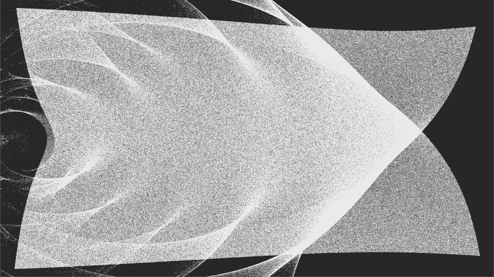

# OpenGL Compute Example
Simple application that uses an OpenGL compute shader to offload particle physics simulation to the GPU.

Particles should be attracted to the cursor.

Ported from [this C++ example](https://github.com/mankeywitz/opengl-compute-example/blob/master/main.cpp) with minor changes.

